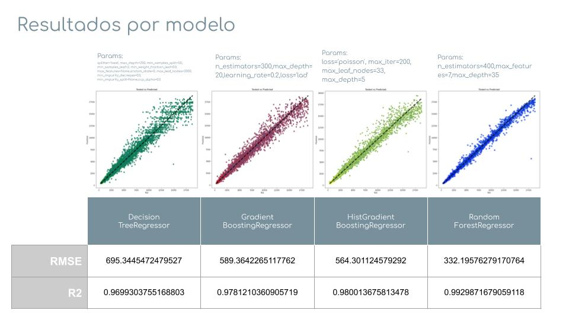

# diamonds-project

El **objetivo** de este proyecto es predecir mediante machine learning el precio de los diamantes atendiendo a sus características (peso, color, calidad de corte).

## Estructura

- Input:

1.- *train.csv*\
2.- *predict.csv*\
3.- *sample.csv*

- Tests:

Esta carpeta contiene el archivo de limpieza y análisis del dataset propuesto para realizar el proyecto (*train_completed*).\
En el entrenamos varios modelos de predicción y una vez analizadas las métricas, seleccionamos los mejores, en este caso:

RandomForestRegressor\
HistGradientBoostingRegressor\
GradientBoostingRegressor\
DecisionTreeRegressor

- Predicciones:

Tras entrenar los modelos y seleccionar los que nos dan mejores métricas, ejecutamos de nuevo con todos los datos y obtenemos el resultado por modelo para exportarlo a csv.

- Output:

Archivos csv con la predicción obtenida de cada modelo cumpliendo con el formato de la competición Kaggle de nuestro bootcamp (<https://www.kaggle.com/c/diamonds-datamad0820>)

